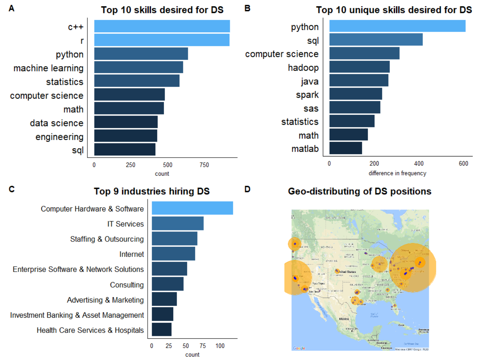

```{r setup, include=FALSE}
knitr::opts_chunk$set(echo = TRUE)
```

## 1 Introduction

In recent years, data scientist has become a popular job and a reasonable choice for many new graduates. The main responsibility of this job is to find, interpret, merge, visualize, model, prsent and communicate data sets and insights.[1] In 2002, Harvard Business Review dubbed it "The Sexiest Job of the 21st Century".[2]  McKinsey & Company also projected a global excess demand of 1.5 million new data scientists.[3]  

A better understanding of the job requirement can help students to be better prepared in the job market. In this project, we performed a study on data scientist, including the required skills, distributions in different industries and states, salaries and employee"s satisfaction based on web-scpared data. Our results suggests that coding skills, especially python, and theoretical skills like statistics and machine learning are highly valued. Furthermore, employee"s satisfaction of their jobs are correlated with the company size, but not with their salaries, states or industries.

## 2 Data

Job data was scraped from "Glassdoor"(www.glassdoor.com) with title "data scientist" using `rvest` package in `r`. Glassdoor is a job search engine and outperforms others in the sense that it contains reviews of employees to the companies and positions. From this website, 990 jobs posted in September 30th 2017 were scraped. (Glassdoor API is not accessible for students and only 1000 jobs can be viewed by normal users.)

For each job posting, the following features were collected: company name, rating, salary, location (city, state), company size, industry and full text of job description. Among these variables, rating is the overall rating of all ratings of all time. Salary is preprocessed to be the mean of the salary range provided in the website. 722 out of 990 job postings contain no missing value. For explortary analysis, missing values are ommited. For inferencial analysis, for simplicity, only complete cases are used. 

To identify "unique skills" of data scientist, we also scraped 990 job postings with job title "quantitative analyst", using the same method as for "data scientist". Since both of the two jobs has responsibility on coding and modeling, we define the "unique skills" of data scientist as those appear with higher frequency in job descriptions of data scientist than quantitative analysts.

## 3 Methods

### 3.1 Identification of "skills" from job descriptions

Our first goal is to identify phrases that represent "skills". The traditional way for achieving this is to tokenize the text (partition it into a vector of words), count the frequency of each word and remove the meaningless "stop words", such as "the", "we" and "of". A set of common stop words can be find [_here_](http://xpo6.com/list-of-english-stop-words/). However, this method fails to work in this case for two reasons. First, the common set of stop words does not contain enough words for identifying skills in job description. For example, words like "area", "opportunity", "career" have much larger frequency than skill words like "python", "statistics", but cannot be filtered out by stop words. Furthermore, such type of words is so many to filter manually. Second, skills are often appeared as phrases rather than single words. When performing tokenization, "machine learning", "data mining" and etc will be seperated into "machine", "learning", "data" and "mining", which no longer have explicit meaning as skills.

To overcome these two difficulties, we provided a method a feasible way to extract "skills" from job description. Our method is based on the following observation: in job descriptions, skills are usually listed, starting with ":" and seperated by ",", "and" or "or". Hence, if we partition the text by these symbols, skill phrases will be indentified as a whole and appear in high frequency since other noise words will remain in long and unique segments. For example, in the following sentence of some job description, 

> "BACKGROUND/EXPERIENCE:
Demonstrates proficiency in most areas of mathematical analysis methods, machine learning, statistical analysis, and predictive modeling and in-depth specialization in some areas." 

we will identfiy "machine learning" and "statistical analysis". As we collect more job descriptions, such skill phrases will appear many times and be distinguishable. Finally we use these skills as key words to search in each job description and get the ultimate count of skill words. The final step is necessary because not all skills are listed in each job description.

As a result, we identify skill phrases with the following steps:

* __Step 1__  tokenize the text of job descrption by seperator ":", ",", ".", "and" and "or";
* __Step 2__  extract the tokens with 3 or fewer words;
* __Step 3__  count the frequency of each token and remove those appearing 50 times or less (58 phrases remained);
* __Step 4__  filter out those irrelavent words manually, such as "religion" and "gender" (32 phrases remained);
* __Step 5__  Use the remained phrases as keyword, search them in every job description and produce an skill-company matrix with a binary value indicating whether one skill is required by one company.

For justifying the feasibility of the above steps, if we assume that each skill appears in each job posting independently with probability $p \ge 0.07$, then by binomial distirbution, the skill will remain in the final list with probability at least $0.99$. 

### 3.2 Statistical analysis for salary and employees" satisfaction

Given the skill-company matrix we get, we can perform statistical analysis on salary. We want to explore which skills can have positive influence on salary, i.e. leading to increase on salary. Also, we are interested in skills that can affect the salary. The method we use is lineary regression, basically, we regress salary onto all indentified skills:
$$ salary \sim skill_1 + skill_2 + \dots + skill_k + \varepsilon$$.
Then we extract and report those skills with significant parameters (p < 0.1).

Apart from salary, employees" ratings of company can be regarded as an index for their satisfaction of this job. Hence we also studied which factors can influnce satisfaction from company size, location, salary and industry. Skills are not included since they don"t have much causal connection. For categorical variable such as company size, location and industry, we used ANOVA for them and rating. For continuous variable salary, we used two samples t-test. The signification factor would be reported.

## 4 Results

### 4.1 Explortory analysis



Explortory analysis was performed using data sets described in section 2. The result is shown in Figure 1. For Figure 1(A), we counted the frequency of each skill across all data scientist job postings and select those with high value. For Figure 1(B), we calculated the difference of frequency of each skill between "data sciencist" job postings and "quantitative analyst" job postings and regard those skills with high positive differences as unique skills for data scientist.  Figure 1(C) and 1(D) show the types of companies that hire most data scientists and the distribution of this job across the United States.

From Figure 1, we observe that

* Programming skills of C++ (low-level), R (statistical), Python (high-level) and SQL (database) are most welcomed by employers. Furthermore, Python and SQL are more emphasized by data scientist than quantitative analyst.
* Theoretical skills, such as machine learning, statistics, computer science and mathematics are also important, all of which are mentioned in at least half of the job descriptions.
* Big data skills like Hadoop and Spark are unique for data scientists.
* Employers of data scientists are mostly from IT, investment and health care companies.
* New York, San Francisco, Chicago, Seattle and Washington have the most open data scientist jobs.


### 4.2 Factors impacting salary and satisfaction

Applying statiscal methods describled in section 3.2, we got the following results (shown in Figure 2.) Five skills have positive effect on salary and python, which is the most popular programming language in recent years, makes the most benefit. In contrast, jobs requiring SAS, math and applied mathematics seems to have lower salaries.

For ratings, it is surprising that none of salary, location or industry is correlated with employee"s ratings: none of them are significaiton (p = 0.01) in the ANOVA test. However, company size is significant with p-value less than $10^{-15}$. As shown in Figure 2(B), as the company size incrases, there is a trend that employees will get less satisfied, but for huge companies with more than ten thousand employees, the rating goes up a litte.


## 5 Conclusions

In this project, we analyzed the common skills, unique skills, industries, locations, salaries and satisfaction of data scientist jobs using both explortory and inferencial analysis methods. Our analysis shows that data scientist jobs are mainly distributed in big cities and high-tech industries, and We found that coding skills, especially python, and theoretical knowedge in statistics and machine learning are highly valued in this area. We also provided some insight on finding skills that are important to increasing salary and factors that plays an role in job satisfaction. Interestingly, salary does not have much relation with satisfaction.

Beyond this project, much more meaningful analysis on job market can be performed. By collecting more data, trend of skills required, multi-job comparison and etc. can be studied. By using more complicated and meaningful models, job classifcation, job recommendation and etc. can be performed. Currently, many job search websites, such as linked in, has done much of them. In the furture, the direction of hunting job and hiring people might be percise targeting the ideal position or the ideal candidate.

## References
1. Wikipedia “Data science” Page. URL: https://en.wikipedia.org/wiki/Data_science. Accessed
10/10/2017.

2. Davenport, Thomas H.; Patil, DJ (Oct 2012), Data Scientist: The Sexiest Job of the 21st Century, Harvard Business Review.

3. Manyika James et al. (May 2011), "Big data: The next frontier for innovation, competition, and productivity". 